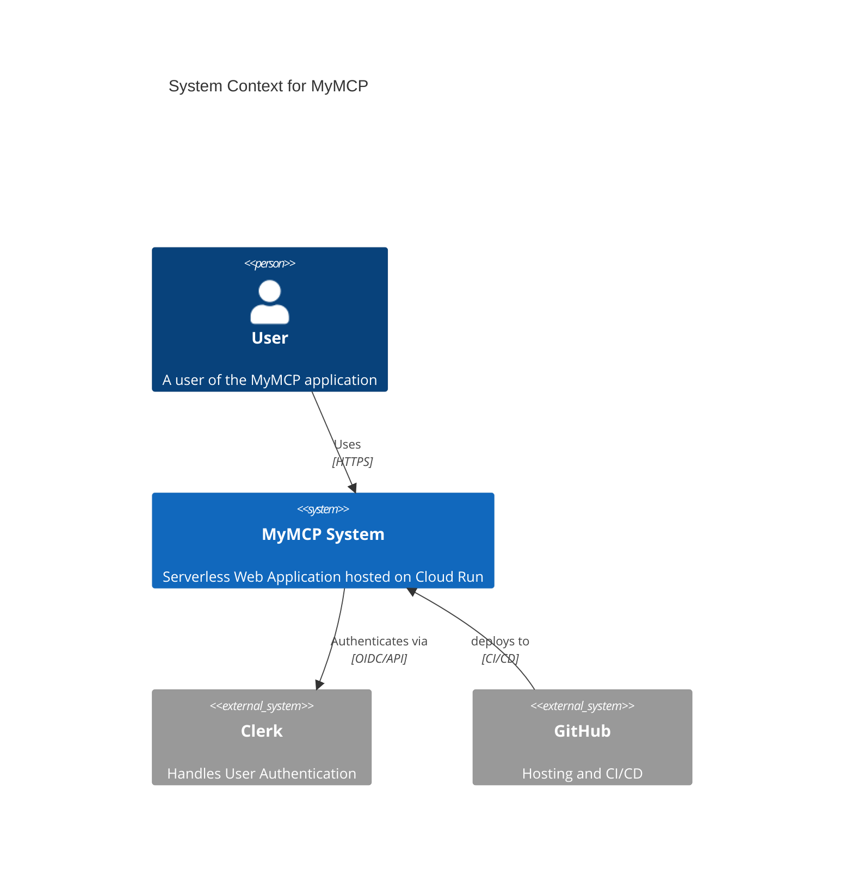
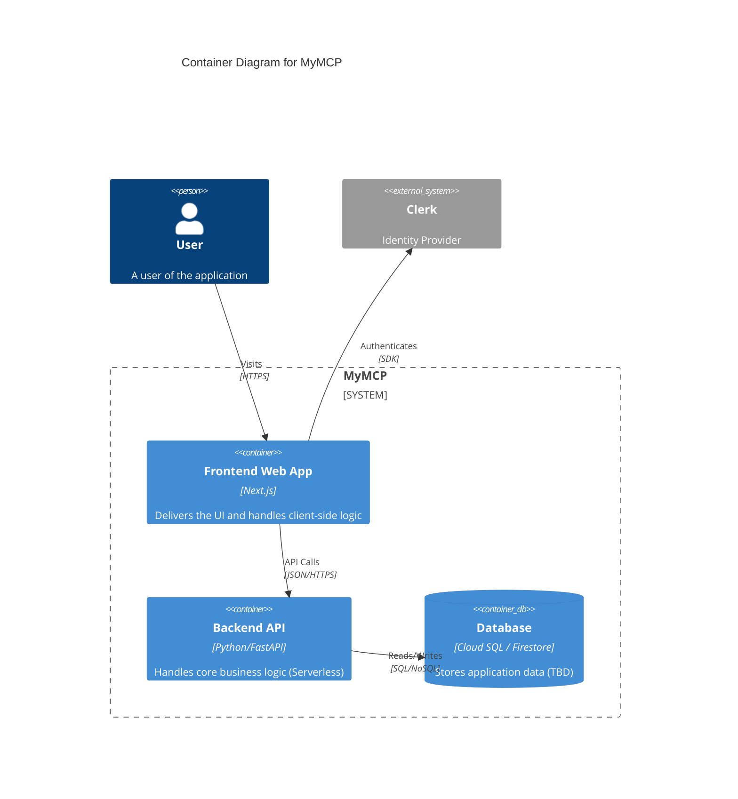

# MyMCP Architecture

This document describes the architecture of the **MyMCP** project using the C4 model.

## 1. System Context Diagram
The **MyMCP** system allows users to interact with... (Context TBD based on deeper requirements, utilizing generic web app context for now).



## 2. Container Diagram
The system consists of a Next.js Frontend and a Serverless Backend.



## 3. Deployment View (Google Cloud Run)
We use a serverless deployment model.

```mermaid
C4Deployment
    title Deployment Diagram
    Deployment_Node(gcp, "Google Cloud Platform", "Cloud Provider") {
        Deployment_Node(cloud_run, "Cloud Run", "Serverless Container Platform") {
            Container(instance, "MyMCP Instance", "Docker Container", "Next.js + Backend")
        }
    }
    Deployment_Node(github_actions, "GitHub Actions", "CI/CD") {
        Container(runner, "CI Runner", "Ubuntu", "Builds and Deploys")
    }
    Rel(github_actions, cloud_run, "Deploys", "gcloud run deploy")
```
