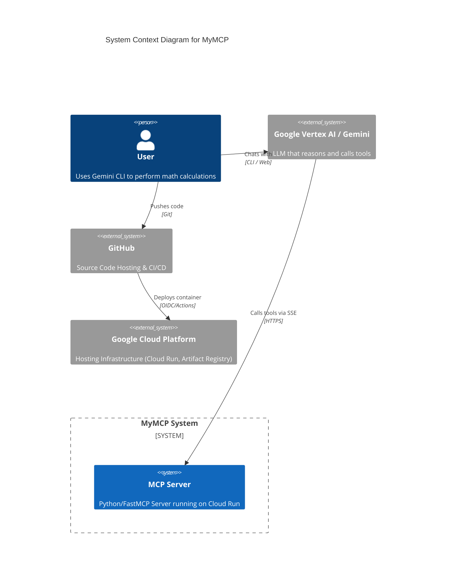

# C4 System Context Diagram

```mermaid
C4Context
    title System Context Diagram for MyMCP

    Person(user, "User", "Uses Gemini CLI to perform math calculations")

    System_Boundary(system, "MyMCP System") {
        System(mcp_server, "MCP Server", "Python/FastMCP Server running on Cloud Run")
    }

    System_Ext(gemini_api, "Google Vertex AI / Gemini", "LLM that reasons and calls tools")
    System_Ext(github, "GitHub", "Source Code Hosting & CI/CD")
    System_Ext(gcp, "Google Cloud Platform", "Hosting Infrastructure (Cloud Run, Artifact Registry)")

    Rel(user, gemini_api, "Chats with", "CLI / Web")
    Rel(gemini_api, mcp_server, "Calls tools via SSE", "HTTPS")
    Rel(user, github, "Pushes code", "Git")
    Rel(github, gcp, "Deploys container", "OIDC/Actions")
```
