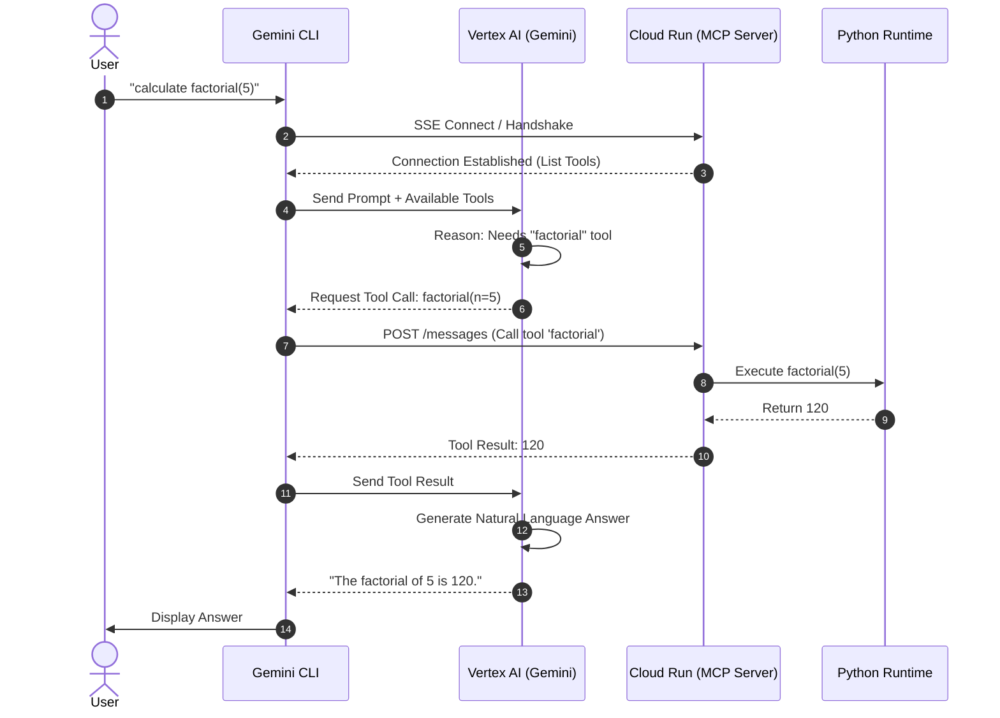

# Request Flow Sequence Diagram

This diagram shows how a user's prompt is processed by Gemini and how the MCP server executes the requested tool.

```mermaid
sequenceDiagram
    autonumber
    actor User
    participant CLI as Gemini CLI
    participant LLM as Vertex AI (Gemini)
    participant CloudRun as Cloud Run (MCP Server)
    participant Python as Python Runtime

    User->>CLI: "calculate factorial(5)"
    CLI->>CloudRun: SSE Connect / Handshake
    CloudRun-->>CLI: Connection Established (List Tools)
    CLI->>LLM: Send Prompt + Available Tools
    LLM->>LLM: Reason: Needs "factorial" tool
    LLM-->>CLI: Request Tool Call: factorial(n=5)
    CLI->>CloudRun: POST /messages (Call tool 'factorial')
    CloudRun->>Python: Execute factorial(5)
    Python-->>CloudRun: Return 120
    CloudRun-->>CLI: Tool Result: 120
    CLI->>LLM: Send Tool Result
    LLM->>LLM: Generate Natural Language Answer
    LLM-->>CLI: "The factorial of 5 is 120."
    CLI->>User: Display Answer
```
