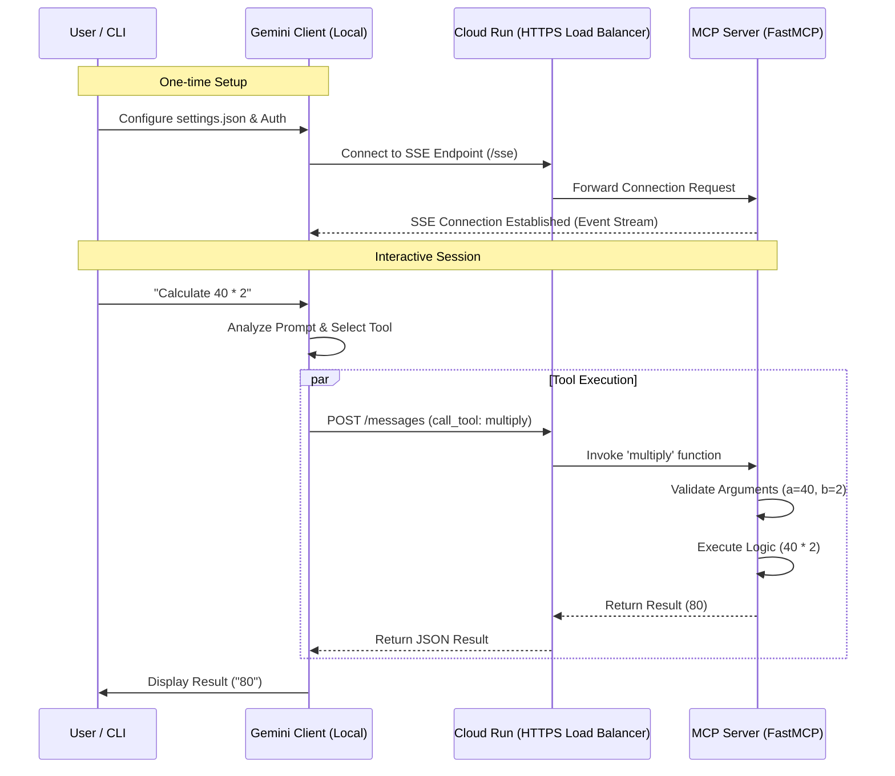
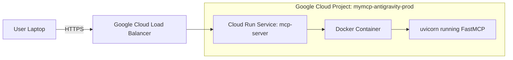

# MCP Server Process Documentation

This document visualizes the workflow and architecture of the deployed MCP (Model Context Protocol) Server.

## 1. High-Level Communication Flow (Sequence Diagram)

This diagram shows how a client (like Gemini CLI or a Python script) interacts with the hosted MCP Server.



## 2. Request Processing Logic (Flowchart)

This diagram details the internal logic when the MCP Server receives a request.

```mermaid
flowchart TD
    A[Incoming Request] --> B{Request Type?}

    B -- SSE Connect --> C[Establish Event Stream]
    C --> D[Keep Alive / Push Updates]

    B -- POST /messages --> E[Parse JSON Payload]
    E --> F{Method Type}

    F -- tools/list --> G[Return List of Tools]
    G --> G1[add, subtract, multiply]

    F -- tools/call --> H[Identify Tool Name]
    H --> I{Tool Exists?}

    I -- No --> J[Return Error: ToolNotFound]
    I -- Yes --> K[Validate Arguments (Pydantic)]

    K -- Invalid --> L[Return Error: ValidationError]
    K -- Valid --> M[Execute Python Function]

    M --> N{Execution Success?}
    N -- No --> O[Return Error: ExecutionFailed]
    N -- Yes --> P[Wrap Result in CallToolResult]
    P --> Q[Return JSON Response]
```

## 3. Deployment Architecture


